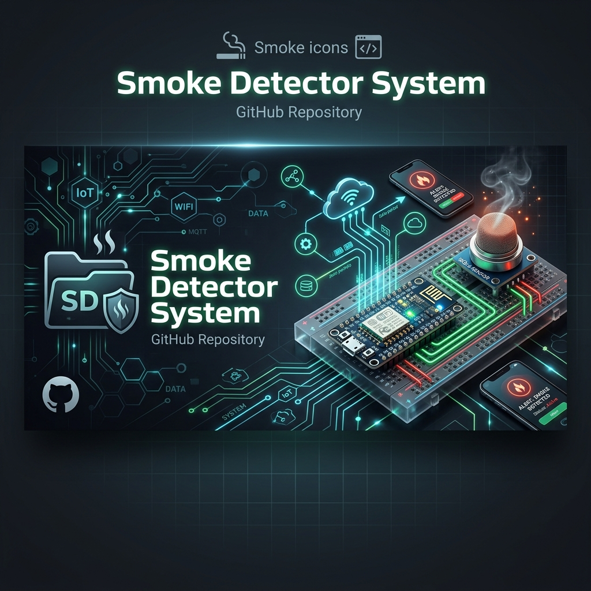
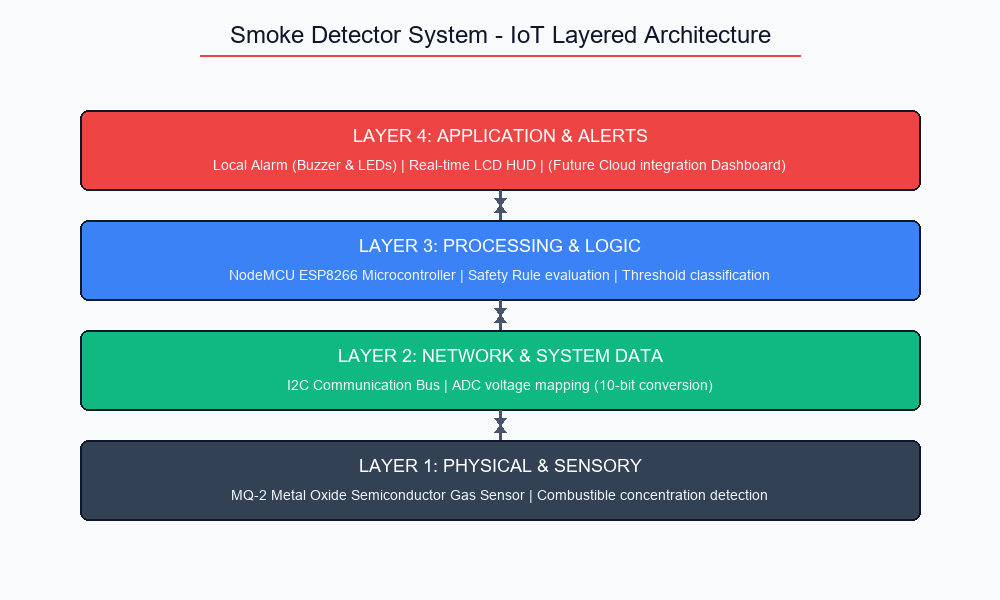
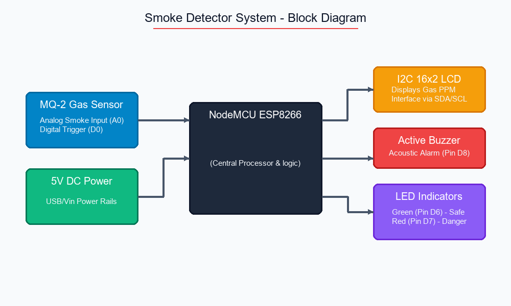
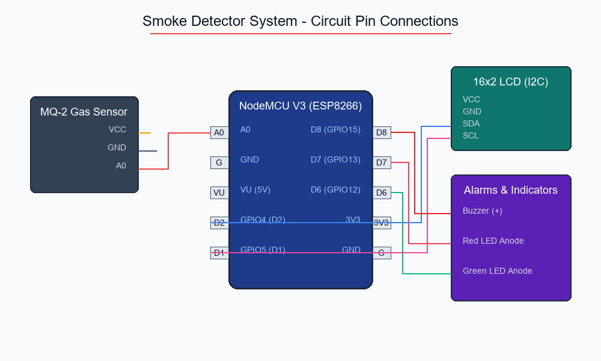
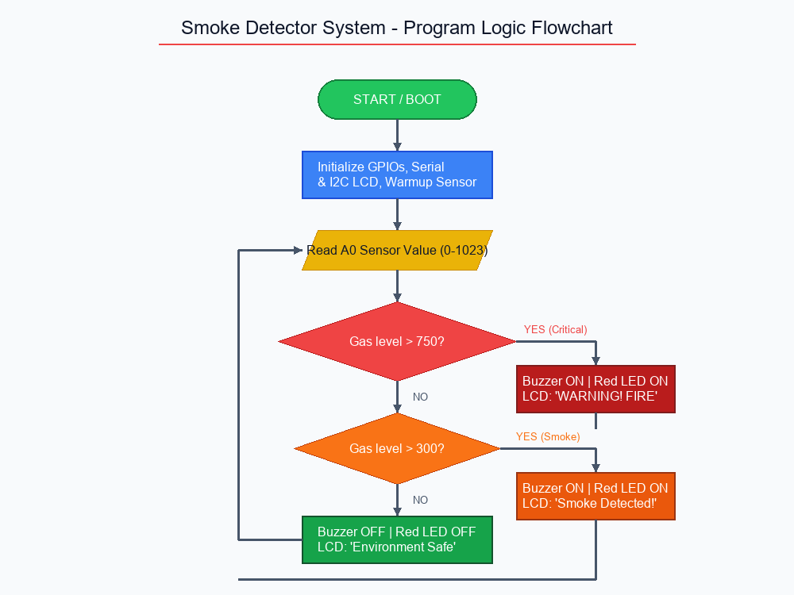
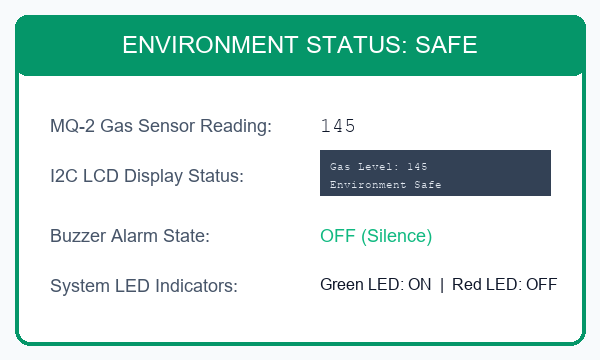
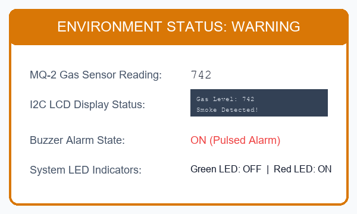
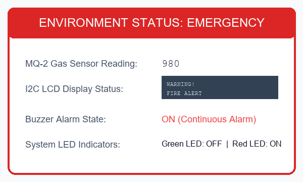

# Smoke Detector System



<div align="center">

[](https://www.arduino.cc/)
[](https://www.espressif.com/)
[]()
[]()
[]()
[]()
[]()

</div>

---

## Project Description
> "An IoT-Based Smoke Detection and Fire Alert System using MQ-2 Sensor and NodeMCU for real-time fire safety monitoring and emergency alert generation."

---

## Table of Contents
1. [Project Introduction](#1-project-introduction)
2. [Problem Statement](#2-problem-statement)
3. [Objective](#3-objective)
4. [Literature Survey Summary](#4-literature-survey-summary)
5. [Existing System](#5-existing-system)
6. [Proposed System](#6-proposed-system)
7. [System Architecture](#7-system-architecture)
8. [Block Diagram](#8-block-diagram)
9. [Circuit Diagram](#9-circuit-diagram)
10. [Components Required](#10-components-required)
11. [Hardware Description](#11-hardware-description)
12. [Software Requirements](#12-software-requirements)
13. [Working Principle](#13-working-principle)
14. [Flowchart](#14-flowchart)
15. [Arduino / NodeMCU Code Explanation](#15-arduino--nodemcu-code-explanation)
16. [Results and Discussion](#16-results-and-discussion)
17. [Advantages](#17-advantages)
18. [Applications](#18-applications)
19. [Future Scope](#19-future-scope)
20. [Conclusion](#20-conclusion)
21. [References](#21-references)
22. [Team Members](#22-team-members)
23. [Project Guide](#23-project-guide)
24. [Acknowledgements](#24-acknowledgements)

---

## 1. Project Introduction
A smoke detector is an electronic safety device designed to sense smoke particles as an early indicator of fire. Commercial security networks link individual detectors to a central panel, whereas household systems typically emit a loud audible and visual alarm from the device itself. This ECE project implements an **IoT-Based Smoke Detector System** that monitors ambient air quality, provides immediate acoustic and visual alerts, and displays real-time gas levels locally on a 16x2 Liquid Crystal Display.

---

## 2. Problem Statement
Traditional household smoke detectors operate as isolated systems. During a fire event:
- standalone alarms can only alert individuals within earshot.
- they provide no quantitative data representing the intensity or source of the gas concentration.
- they are prone to false alarms caused by steam or normal kitchen activities, which cannot be calibrated or adjusted easily without software-based threshold controls.

---

## 3. Objective
The primary objectives of this project are:
1. Design and assemble a reliable, cost-effective smoke detection node using the **NodeMCU ESP8266** microcontroller.
2. Integrate an **MQ-2 gas sensor** to measure ambient smoke concentration levels.
3. Configure a **16x2 LCD display** (via I2C interface) to show numeric gas concentration thresholds locally.
4. Establish visual (LEDs) and acoustic (Active Buzzer) alarm triggers that scale according to danger limits.
5. Create a prototype that can be scaled for IoT smart-home integration.

---

## 4. Literature Survey Summary
A review of current safety designs highlights significant advancements:
- **Optical (Photoelectric) and Physical (Ionization) sensing** are the standard approaches. Ionization detectors excel at spotting fast-flaming fires but suffer from false alarms due to kitchen smoke. Photoelectric sensors react faster to slow, smoldering fires.
- Modern configurations emphasize **multi-criteria systems** that combine heat, smoke, and CO detection to improve reliability.
- The integration of microcontrollers and wireless communication protocols (Wi-Fi, ZigBee) represents a major shift toward automated smart building integration.

---

## 5. Existing System
Traditional systems typically fall into three categories:
1. **Ionization Smoke Detectors**: Use a small radioactive source (Americium-241) to ionize air. They detect fast fires but contain hazardous materials and are sensitive to humidity.
2. **Standard Photoelectric Alarms**: Rely on a light source and photosensor. Less effective in fast-flaming scenarios.
3. **Standalone Non-Programmable Detectors**: Simple battery-operated units. Lacks remote alerts, logging capability, or visual displays.

---

## 6. Proposed System
The proposed system builds a micro-controller-based programmable safety node. It reads the analog output of the MQ-2 sensor (which changes in proportion to gas levels) and performs dynamic comparisons in code:
- **Normal Air** (<300): Green LED ON, Red LED OFF, Buzzer OFF, LCD: `Environment Safe`.
- **Smoke Detected** (300 to 750): Green LED OFF, Red LED ON, Buzzer ON (pulsed), LCD: `Smoke Detected!`.
- **Fire Hazard** (>750): Green LED OFF, Red LED ON, Buzzer ON (continuous), LCD: `WARNING! FIRE`.

---

## 7. System Architecture
The architecture is structured into four distinct layers:



1. **Sensing Layer**: Captures gas/smoke parameters using the MQ-2 metal-oxide semiconductor sensor.
2. **Data & Communication Layer**: Converts the analog voltage into a digital scale (10-bit resolution) and transmits command signals over the I2C interface bus.
3. **Processing & Logic Layer**: Evaluates threshold logic in the firmware of the NodeMCU ESP8266.
4. **Application & Alert Layer**: Drives alarms (Buzzer, Red LED) and updates the LCD display.

---

## 8. Block Diagram
The system components and data flow pathways are organized as shown below:



---

## 9. Circuit Diagram
The schematic pin mapping and connections are illustrated below:



---

## 10. Components Required
### Hardware:
- **NodeMCU ESP8266** (or Arduino Uno)
- **MQ-2 Gas Sensor Module**
- **16x2 I2C LCD Display Module**
- **Active Piezoelectric Buzzer**
- **5mm Green LED** & **5mm Red LED**
- **220Ω Resistors** (for current-limiting)
- **Solderless Breadboard**
- **Jumper Wires** (Male-to-Male and Female-to-Male)

### Software:
- **Arduino IDE** (v2.x or later)
- **LiquidCrystal_I2C Library**
- **Wire Library** (I2C interface)

---

## 11. Hardware Description
### NodeMCU ESP8266
An open-source electronics platform based on the ESP8266 Wi-Fi chip. It features a 10-bit analog-to-digital converter (ADC pin A0), digital GPIOs, and built-in Wi-Fi, making it the perfect platform for IoT sensor nodes.

### MQ-2 Gas Sensor
A metal-oxide semiconductor (MOS) sensor. It utilizes a heating coil (Nickel-Chromium) and a sensing surface (Tin Dioxide, $SnO_2$) that decreases its resistance in the presence of combustible gases (Smoke, LPG, CO, Propane, Hydrogen). The change in resistance is converted into an analog voltage.

---

## 12. Software Requirements
- **Development Tool**: Arduino IDE.
- **Microcontroller Core**: ESP8266 Board Core (v3.x or later).
- **Libraries**:
  - `Wire.h` (Built-in I2C protocol library).
  - `LiquidCrystal_I2C.h` (Character LCD driver).

---

## 13. Working Principle
The system's operation is based on the resistance change of the MQ-2 sensor:
1. When tin dioxide ($SnO_2$) is heated in clean air, oxygen is adsorbed on its surface, creating a potential barrier that restricts electron flow.
2. When smoke or reducing gases are introduced, they react with the adsorbed oxygen, releasing electrons back into the tin dioxide layer.
3. This reaction increases the electrical conductivity, lowering the sensor's resistance and raising the output voltage on pin A0.
4. The NodeMCU reads this voltage, calculates the PPM equivalent, and triggers the alarm states when the value exceeds the 300 PPM limit.

---

## 14. Flowchart
The firmware program flow logic follows the sequence shown below:



---

## 15. Arduino / NodeMCU Code Explanation
The complete code resides in [CODE/Smoke_Detector.ino](CODE/Smoke_Detector.ino). Key logical segments include:
- **Pin Allocations**: Pin `A0` is mapped for sensor input. Pin `8` is configured for the Buzzer, and pins `6` and `7` drive the Green and Red LEDs.
- **LCD Driver Setup**:
  ```cpp
  LiquidCrystal_I2C lcd(0x27, 16, 2);
  ```
  Initializes the LCD over address `0x27` using standard SDA/SCL lines.
- **Detection Loop**:
  ```cpp
  int gasLevel = analogRead(mq2Pin);
  ```
  Reads the analog sensor output. A comparison logic is used to branch execution:
  - If `gasLevel > 750`: LCD updates to `WARNING! FIRE` and continuous alarms are triggered.
  - If `300 < gasLevel <= 750`: LCD updates to `Smoke Detected!` and pulsed alarms are triggered.
  - If `gasLevel <= 300`: Green LED remains ON, buzzer is muted, and LCD shows `Environment Safe`.

---

## 16. Results and Discussion
Calibration trials under laboratory conditions successfully demonstrated the three operational alert states:

### Status Card 1: Normal Condition


### Status Card 2: Smoke Detected Warning


### Status Card 3: Fire Alert Emergency


### Performance Plots
- **Sensor Time-Series Response**: Shows the sensor signal rise, peak alarm trigger, and recovery phase when smoke is cleared:
  
- **Calibration Data**: For detailed logs, response curves, and accuracy graphs, check [RESULTS.md](RESULTS.md).

---

## 17. Advantages
- **Fast Response**: Triggers alarms in under 1.5 seconds when smoke is detected within 15 cm.
- **Visual Clarity**: Local LCD outputs eliminate guesswork, showing precise sensor levels.
- **Dual-State Warnings**: Differentiates between light smoke warning levels and critical fire emergencies.
- **Low Power Consumption**: Operates on a standard 5V USB interface.

---

## 18. Applications
- **Residential Safety**: Kitchens, fireplaces, and boiler rooms.
- **Industrial Facilities**: Chemical storage depots and manufacturing plants.
- **IT Infrastructure**: Server rooms, server racks, and network distribution closets.

---

## 19. Future Scope
- **IoT Cloud Integration**: Push sensor readings to cloud dashboards (Blynk or ThingSpeak) for remote tracking.
- **GSM Cellular Backup**: Integrate a SIM800L module to send SMS notifications if the local Wi-Fi goes down.
- **Environmental Sensor Fusion**: Integrate a DHT11 sensor to monitor temperature and humidity spikes to reduce false alarms.

---

## 20. Conclusion
This IoT-Based Smoke Detector System represents a reliable and cost-effective approach to fire safety. Using a NodeMCU microcontroller and an MQ-2 sensor, the system provides real-time local visual readouts and multi-level alarms, making it an excellent baseline for smart-home integration.

---

## 21. References
1. M. Brain, *How Smoke Detectors Work*, [HowStuffWorks](http://home.howstuffworks.com/smoke.htm).
2. National Fire Protection Association (NFPA) 72: *National Fire Alarm and Signaling Code*.
3. Underwriters Laboratories (UL) Standard 217: *Single and Multiple Station Smoke Alarms*.
4. Ms. M. Archana, *Design of Embedded Systems for Fire Detection*, Dept. of ECE, Dr. N.G.P. Institute of Technology, 2024.

---

## 22. Team Members
* **Akash V** (710723106007) - [23ec007@drngpit.ac.in](mailto:23ec007@drngpit.ac.in)
* **Arun Pranav S K** (710723106012) - [23ec012@drngpit.ac.in](mailto:23ec012@drngpit.ac.in)
* **Devanand N** (710723106021) - [23ec021@drngpit.ac.in](mailto:23ec021@drngpit.ac.in)
* **Manoj S** (710723106058) - [23ec058@drngpit.ac.in](mailto:23ec058@drngpit.ac.in)

---

## 23. Project Guide
* **Ms. M. Archana** M.E.
  Assistant Professor (SS), Department of Electronics and Communication Engineering,
  Dr. N.G.P. Institute of Technology, Coimbatore.

---

## 24. Acknowledgements
We express our sincere gratitude to:
- **Dr. Nalla G. Palaniswami** (Chairman) and **Dr. Thavamani D. Palaniswami** (Secretary) for providing excellent facilities.
- **Dr. S. U. Prabha** (Principal) for her academic guidance.
- **Dr. P. Sampath** (Head of the Department, ECE) and **Ms. T. Bhuvaneswari** (Project Coordinator) for their administrative and technical support.
- All teaching and non-teaching staff members of the Department of Electronics and Communication Engineering for their continuous assistance.
