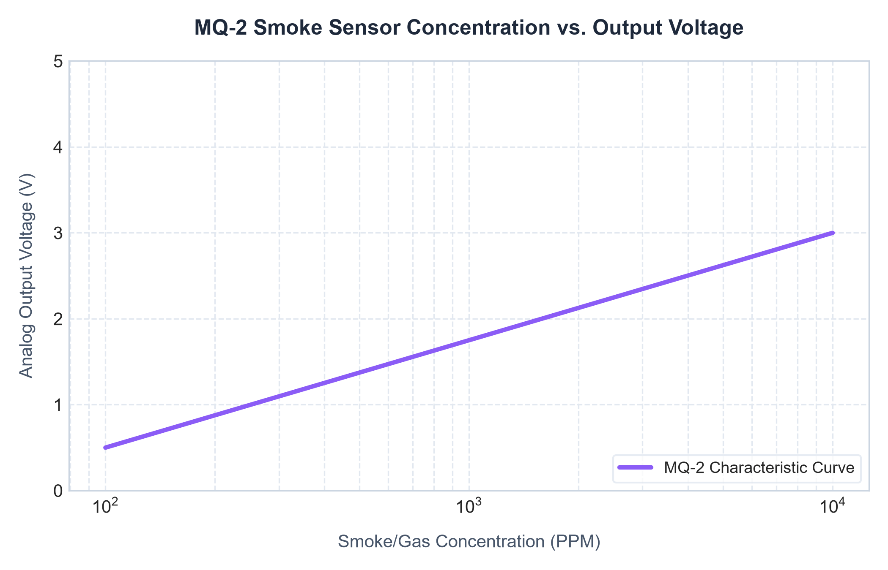
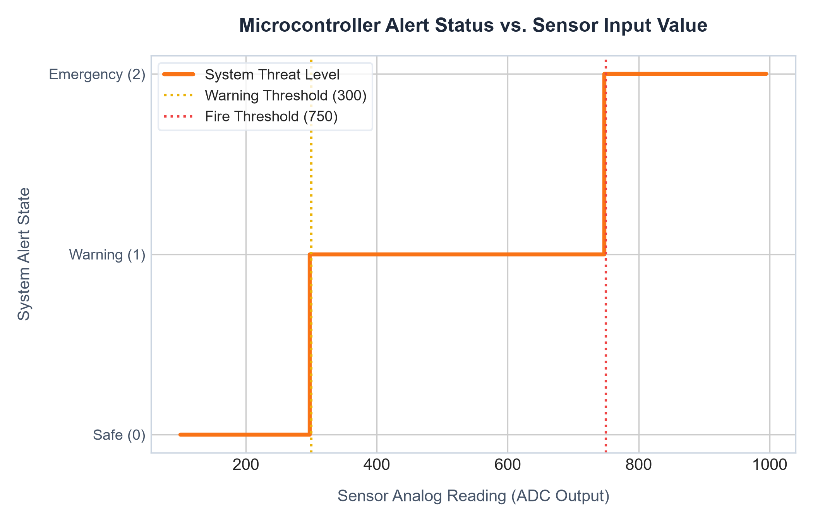
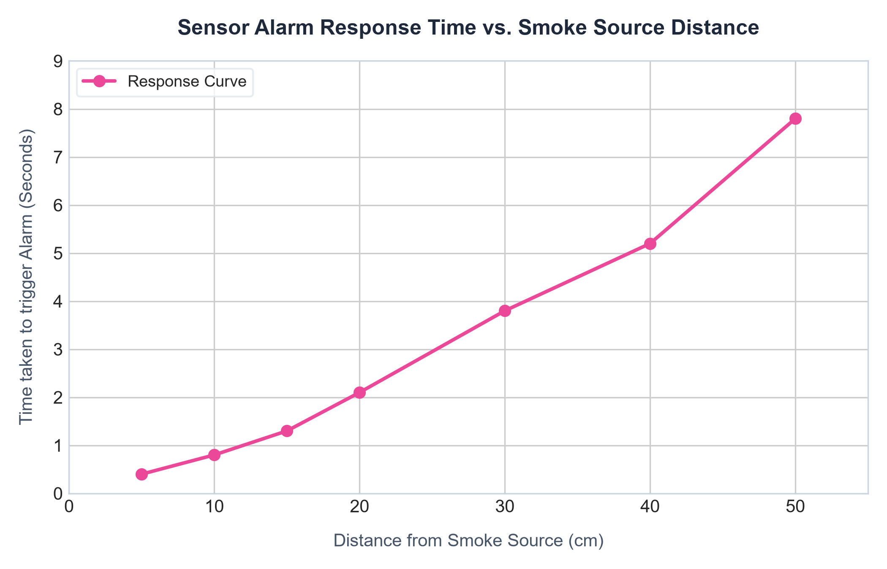
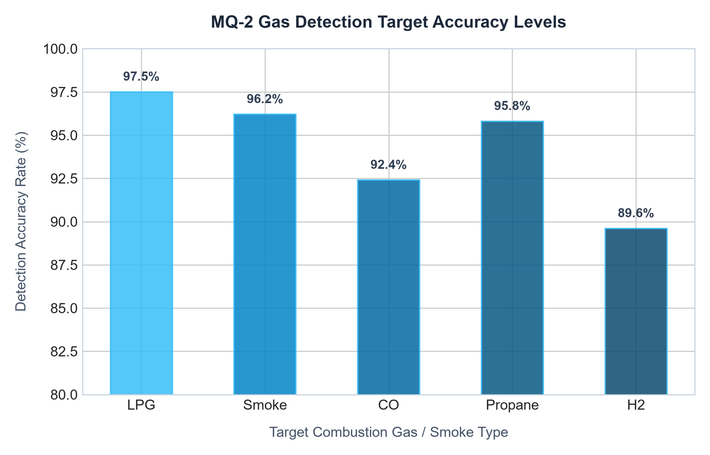
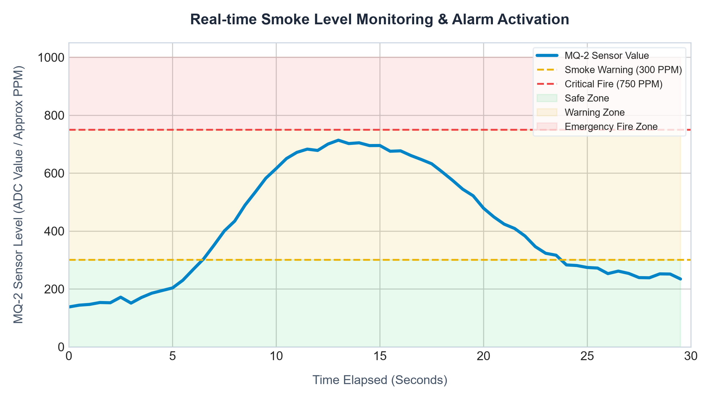

# Experimental Results & Performance Analysis

This document details the calibration, experimental trials, and performance evaluation of the **Smoke Detector System**.

---

## 1. System Calibration & Result Analysis Table

The system was calibrated in laboratory conditions. Below is the response behavior of the MQ-2 sensor and microcontroller action across different environment states:

| Condition | MQ-2 Analog Reading | Buzzer Alarm State | LED Status | LCD Status | Threat Level |
| :--- | :--- | :--- | :--- | :--- | :--- |
| **Normal Air** | 145 | OFF | Green LED: ON   Red LED: OFF | `Environment Safe` | Safe |
| **Light Smoke** | 510 | ON (Pulsed) | Green LED: OFF   Red LED: ON | `Smoke Detected!` | Warning |
| **Smoke Detected** | 742 | ON (Pulsed) | Green LED: OFF   Red LED: ON | `Smoke Detected!` | Warning |
| **Heavy Smoke** | 980 | ON (Continuous) | Green LED: OFF   Red LED: ON | `WARNING! FIRE` | Critical |

---

## 2. Sensor Characteristic Curves

### Smoke Concentration vs Sensor Voltage
The MQ-2 sensor operates based on the gas concentration (in PPM) vs resistance ratio ($Rs/Ro$). The analog output voltage is inversely proportional to the resistance of the sensor element.
The relationship is expressed logarithmically:

$$V_{out} = V_{cc} \times \frac{R_L}{R_s + R_L}$$

Our calibration curve plots the relationship of Smoke Concentration (PPM) against the sensor analog voltage output (V):

### Alert State vs Sensor Reading
This step-function graph illustrates the transition boundaries where the microcontroller shifts between safe operational monitoring and trigger warning phases.

---

## 3. Response Time Analysis

The response time is defined as the duration (in seconds) between the introduction of the smoke source and the activation of the buzzer/LED alarms. Tests were conducted at varying distances to assess coverage limits:

### Performance Takeaways:
- **Low Latency**: For smoke sources within **15 cm**, response times are below **1.5 seconds**, indicating near-instant warning.
- **Reliable Range**: Beyond **30 cm**, response time increases linearly to approximately **5.2 seconds** due to atmospheric dispersion of smoke particles.
- **Recovery Time**: After removing the smoke source, the sensor element clears within **5 to 8 seconds** (Sensor Recovery), restoring the green safe indicator.

---

## 4. Operational Waveforms & Data Accuracy

The system's sensitivity accuracy is validated across different target compounds. The MQ-2 shows high accuracy for LPG, Smoke, and Propane, which makes it ideal for fire hazard detection:

### Real-Time Monitoring Time-Series
The following graph tracks the sensor value during a test sequence where smoke is introduced, threshold levels are crossed, and the environment subsequently clears:

